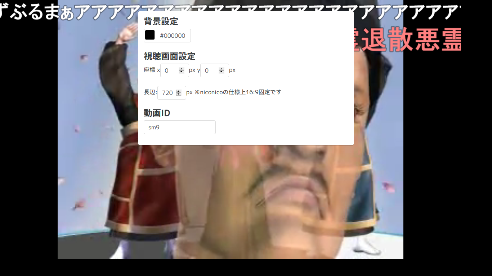

# s_nico
niconico視聴集中モード(PC向け)

## Example URL

http://tamaina.bikkuri.link/s_nico/

## How To Use

画面を開いたら、動画の周囲のどこかをクリックしてください。

以下のようなダイアログが出現します。

ダイアログの内容は、説明不要だと思います。

ダイアログの周囲をクリックして閉じます。

### URLパラメータ

上記ダイアログの内容は、URLから直接変更することができます。

#### bgcolor

画面の背景色をウェブカラー(#抜き)で指定します。

http://tamaina.bikkuri.link/s_nico/?id=sm30303447&bgcolor=75001b

#### id

再生する動画IDを指定します。

http://tamaina.bikkuri.link/s_nico/?id=sm5054636

#### h

再生画面の高さ(短辺)を指定します。

http://tamaina.bikkuri.link/s_nico/?id=sm2064366&h=100

#### x / y

マージンを指定します。

http://tamaina.bikkuri.link/s_nico/?id=sm8628149&h=480&x=128&y=128

?id=sm9&h=720&x=20&y=20&bgcolor=000000

## Others

**https接続の場合、動画が再生できません。**

## Author

tamaina(tamaina.github.io)